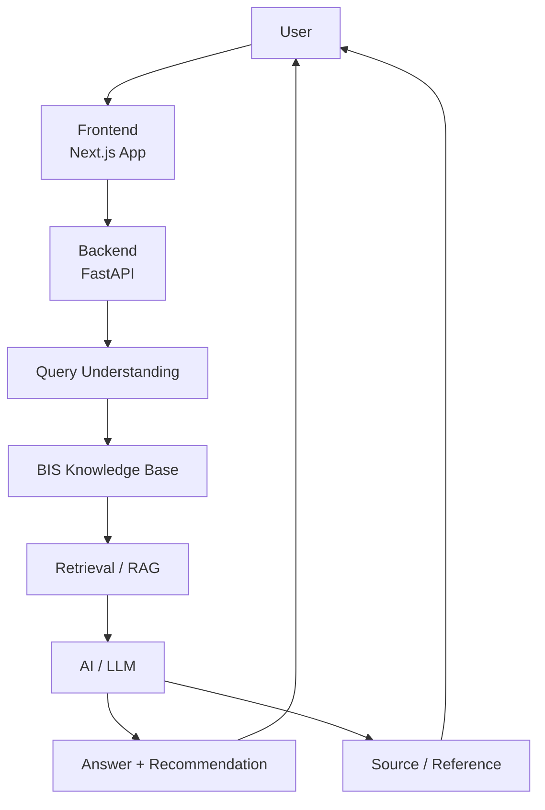

# Architecture Diagram

## Summary

- Frontend handles user interaction.
- Backend routes BIS queries and services.
- Query understanding identifies product, service, or certification intent.
- BIS knowledge base stores verified product and service data.
- Retrieval and RAG help select the relevant information.
- AI generates the final answer with source references.
