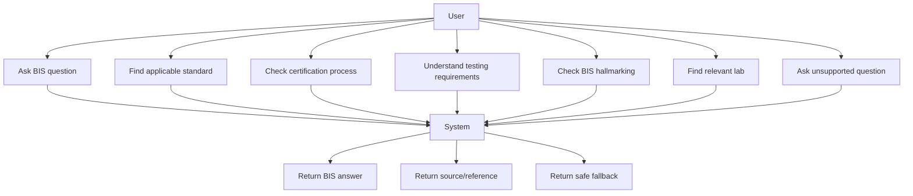

# Use-Case Diagram

## Actors

- Industry user
- Consumer user
- BIS assistant system

## Features covered

- Product recommendation
- Certification guidance
- Testing information
- Hallmarking guidance
- Lab discovery
- Safe unsupported-query behavior
