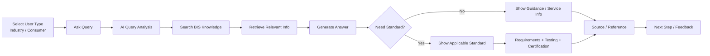

# User Flow Diagram

## Example flows

### Industry

- Ask about a manufactured product
- Receive standard recommendation
- View requirements, tests, and certification guidance

### Consumer

- Ask about BIS mark or consumer guidance
- Receive simplified explanation and official references
